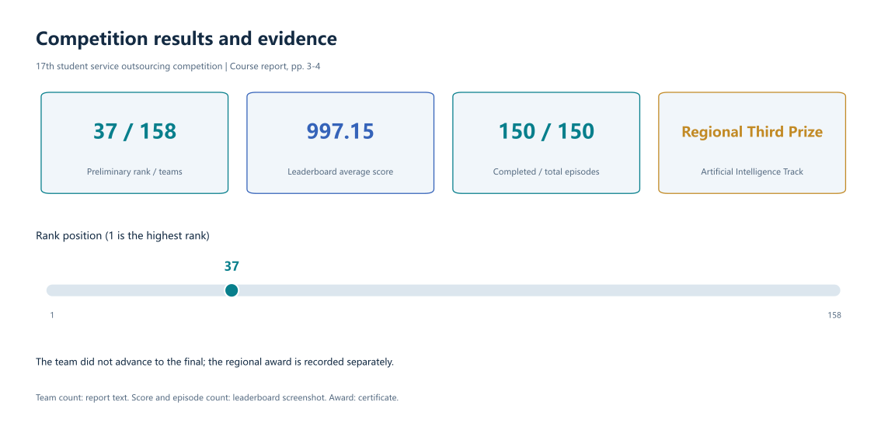
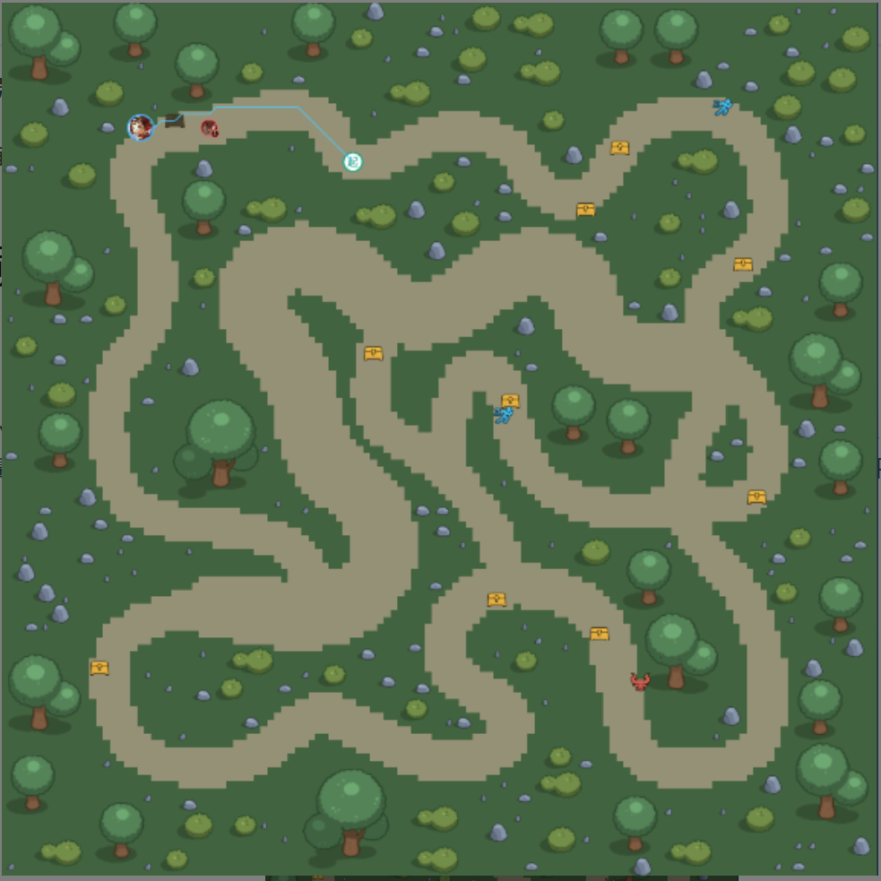
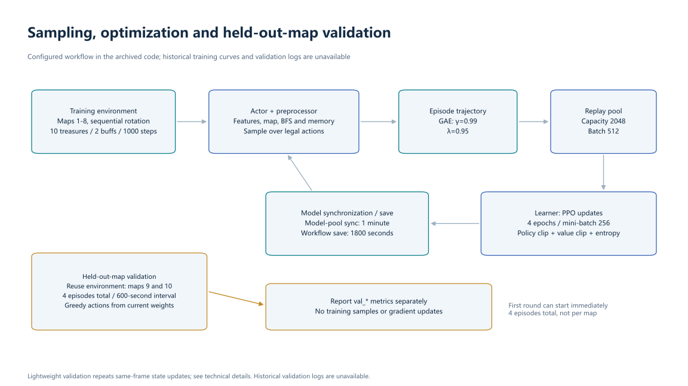

# Tencent Kaiwu: PPO Treasure-Hunting Agent

[中文](README.md) · [Technical details](docs/method.en.md) · [Result evidence](docs/results.en.md) · [Data inventory](data/README.md)

This project develops an agent for Tencent Kaiwu's `gorge_chase` environment (峡谷追猎). The agent controls Luban No. 7, collects treasures, evades pursuing monsters, and decides when to use speed buffs and directional flash. It combines **PPO, separate MLP/CNN encoders and a learned type gate** with local BFS features, target caches and explicit behavioral memory.

At each step, nearby terrain, threats, resources and recent behavior become features. A neural network selects a movement or flash action, and training updates that policy from reward feedback.

The project participated in the **17th China University Student Service Outsourcing Innovation and Entrepreneurship Competition, Eastern Regional Competition, Artificial Intelligence Track** (descriptive English translation). This repository archives the competition code, the final package's checkpoint, the original report and task guide, with bilingual figures, structured result data and offline checks.

## Competition results



| Item | Result | Evidence |
|---|---:|---|
| Preliminary rank | **37 / 158** | Report p. 3 text; screenshot confirms rank 37 |
| Leaderboard average score | **997.15** | Leaderboard screenshot, team `ChatGPT` |
| Completed / total episodes | **150 / 150** | Same screenshot |
| Regional award | **Third Prize** | Certificate on p. 4, June 2026 |
| Final qualification | Did not advance | Report p. 3 text |

These are historical results recorded in the supplied materials. The episode count describes completed evaluations, not a win rate. Per-episode scores, training curves, validation logs and ablation data are unavailable; no score variance, module improvement or held-out-map result is claimed. See [evidence and interpretation](docs/results.en.md).

## Task and scoring

The hero moves in a **128 × 128** grid and observes a **21 × 21** local region. Two monsters appear over time and pursue the hero. Treasures add score, buffs temporarily increase movement speed, and flash crosses terrain subject to a cooldown.



Map illustration from task-guide p. 2.

The [task guide](docs/reports/task-guide.pdf), pp. 3–9, defines the episode score as:

$$S = 1.5 \times \text{survived steps} + 100 \times \text{treasures collected}.$$

The environment offers 10 public maps and 5 hidden evaluation maps. The archived local configuration trains on maps 1–8 and reserves maps 9 and 10 for lightweight validation. Hidden maps are provided by the competition platform. **Training reward differs from competition score:** it also includes safety, terrain, flash quality and anti-loitering terms.

## Implemented work

| Component | Implementation | Source |
|---|---|---|
| State representation | 73 structured dimensions + 8 map channels, 3601 dimensions total | [preprocessor.py](agent_ppo/feature/preprocessor.py) |
| Local search and memory | Eight-neighbor BFS, reachable-area ratios, decaying treasure cache, buff-location cache, exploration and visit memory | Same file |
| Policy network | Six independent MLP encoders, a map CNN, a five-branch context gate and actor/critic heads | [model.py](agent_ppo/model/model.py) |
| Optimization | PPO policy/value clipping, GAE, advantage normalization, entropy regularization and gradient clipping | [algorithm.py](agent_ppo/algorithm/algorithm.py), [definition.py](agent_ppo/feature/definition.py) |
| Reward shaping | Treasure, survival, danger, squeeze, terrain, buff, flash quality and loitering in safe states | [configuration](agent_ppo/conf/conf.py), preprocessor |
| Training workflow | Episode trajectories, model synchronization, periodic saving and separate `val_*` monitoring | [train_workflow.py](agent_ppo/workflow/train_workflow.py) |

These describe implemented functions. Their individual contributions to the competition score have not been measured by ablation experiments.

The CNN encodes spatial terrain, BFS supplies local reachable distances, and caches retain previously observed resources. The gate combines feature branches using hero/map information; PPO updates the action policy from trajectory rewards.

## Network and observation


| Input branch | Dimensions | Contents |
|---|---:|---|
| Hero | 14 | Position, progress, scores, skill cooldown, movement speed |
| Monsters | 16 | Presence, visibility, relative position, distance and speed of two monsters |
| Treasures | 14 | Visible-target BFS distance, cached-target Euclidean distance and exploration frontier |
| Buffs | 8 | Estimated timer, visible or cached targets and flash history |
| Topology | 13 | Openness, obstacle density, branches, dead-end risk, wall proximity and eight reachable-area ratios |
| Memory | 8 | Revisits, position diversity, displacement, exploration direction and no-progress flag |
| Local map | 3528 | `8 × 21 × 21`: traversable cells, obstacles, hero, monsters, treasures, buffs, visit heat and danger |

The model has **75,814 parameters**. The archived checkpoint contains **44 tensors**, loads strictly into the network and passes numeric and forward-output checks. See [method details](docs/method.en.md) for tensor shapes, parameter allocation and reward formulas.

## Training configuration



| Environment | Archived value | PPO | Archived value |
|---|---|---|---|
| Training / validation maps | 1–8 / 9 and 10 | γ / GAE λ | 0.99 / 0.95 |
| Treasures / buffs | 10 / 2 | Adam learning rate | 3 × 10⁻⁴ |
| Buff respawn / flash cooldown | 200 / 200 steps | Policy/value clip range | 0.2 |
| Second monster / monster speedup | 200 / 300 steps | Entropy / value coefficient | 0.005 / 0.5 |
| Episode step limit | 1000 | Epochs / mini-batch | 4 / 256 |
| Lightweight validation | 4 episodes total per round, 600-second interval | Learner batch / pool capacity | 512 / 2048 |

Training samples actions stochastically; validation takes the maximum-probability action and does not send trajectories to the training pool. The original implementation has repeated same-frame preprocessing and mismatched environment/reference thresholds; see [implementation boundaries](docs/method.en.md#7-implementation-boundaries).

## Repository map

```text
agent_ppo/       Original PPO agent, features, network, rewards and workflow
agent_diy/       Original unimplemented DIY template; not a comparison baseline
conf/           Original platform runtime configuration
ckpt/           Checkpoint 34055, id_list and kaiwu.json
archive/        Previous evaluation configuration: 54627 (weights unavailable)
data/           Competition CSV/JSON, feature/weight metadata and SHA-256 inventory
docs/           Bilingual technical/results documentation, PDFs, evidence and figures
scripts/        Weight/integrity inspection and figure tools
tests/          Offline checks of the original numerical code
```

The supplied directory contains 57 files. Forty are preserved byte for byte with provenance; 16 reproducible Python cache files and one platform signing artifact are excluded, with hashes and reasons in the [archive inventory](data/metadata/original_files.json). Historical trajectories and map data were not supplied. The [synthetic observation](data/examples/synthetic_observation.json) is an interface fixture, not a recorded game.

## Contributors and sources

The report lists Liu Runzhang (刘润章), Chen Xudong (陈旭东) and Nan Yibo (南怡波), each contributing approximately one third of solution development and iteration. Chen prepared the report, Nan the slides, and Liu the explanatory video. The supplied directory contains no slide deck or video. The [report](docs/reports/course-report.pdf) and [task guide](docs/reports/task-guide.pdf) are preserved as supplied; see [NOTICE](NOTICE.md) for third-party attribution.

Algorithm references: [PPO](https://arxiv.org/abs/1707.06347), [GAE](https://arxiv.org/abs/1506.02438). SVG and PNG figures are in `docs/figures/`; see [figure provenance](docs/results.en.md#figure-provenance).
