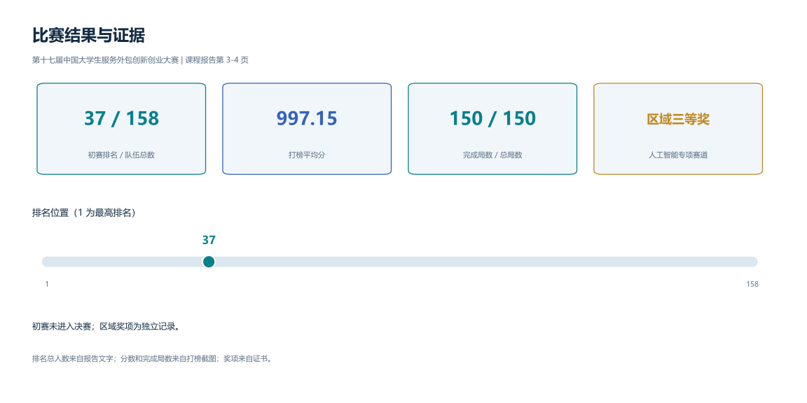
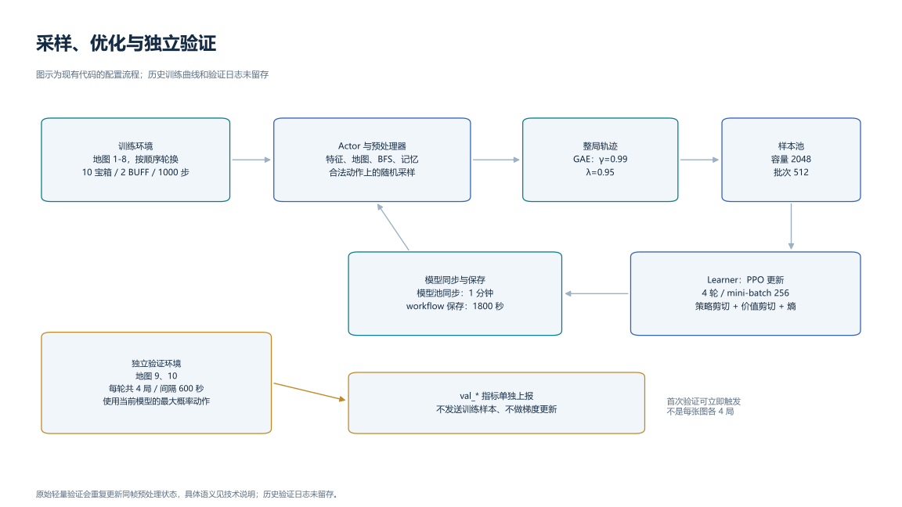

# 腾讯开悟：PPO 峡谷寻宝智能体

[English](README.en.md) · [技术说明](docs/method.zh-CN.md) · [成绩证据](docs/results.zh-CN.md) · [数据清单](data/README.md)

本项目面向腾讯开悟 `gorge_chase`（峡谷追猎）比赛环境：控制鲁班七号在地图中收集宝箱、躲避怪物，并选择何时使用加速 BUFF 和闪现。策略使用 **PPO + 多分支 MLP/CNN + 动态门控**，结合局部 BFS、目标缓存和行为记忆处理寻宝与生存决策。

每一步，系统把附近地形、怪物、资源和近期行为转为特征，由神经网络给出移动或闪现动作；训练通过动作产生的奖励反馈更新策略。

比赛来源为**第十七届中国大学生服务外包创新创业大赛，东部区域赛人工智能专项赛道**。仓库归档竞赛代码、最终训练包中的模型、原始报告和赛题说明，并提供双语图表、结构化结果数据及离线检查。

## 比赛结果



| 项目 | 结果 | 证据 |
|---|---:|---|
| 初赛排名 | **37 / 158** | 报告第 3 页文字；截图显示第 37 名 |
| 打榜平均分 | **997.15** | 第 3 页打榜截图，队名 `ChatGPT` |
| 完成局数 / 总局数 | **150 / 150** | 同一打榜截图 |
| 区域奖项 | **三等奖** | 第 4 页奖项证书，2026 年 6 月 |
| 决赛晋级 | 未进入决赛 | 第 3 页报告文字 |

以上为原始材料记录的历史成绩。150/150 表示完成评测局数，不表示胜率。逐局得分、训练曲线、验证日志和消融数据未留存，因此不报告均值之外的方差、模块提升幅度或未见地图成绩。原始证据与统计口径见[结果说明](docs/results.zh-CN.md)。

## 任务如何计分

英雄在 **128 × 128** 栅格地图中行动，每次观察以自身为中心的 **21 × 21** 局部区域。两只怪物陆续追击；宝箱提供得分，BUFF 暂时提高移速，闪现可穿越地形并进入冷却。


地图示意来自赛题说明第 2 页。

按[赛题说明](docs/reports/task-guide.pdf)第 3–9 页，单局得分为：

$$S = 1.5 \times \text{存活步数} + 100 \times \text{收集宝箱数}.$$

环境包含 10 张开放地图和 5 张隐藏评测地图。本地配置使用地图 1–8 训练，9、10 作轻量验证；隐藏地图由比赛平台提供。**训练奖励与比赛得分不同**：奖励还包含避险、地形、闪现质量和防徘徊等引导项。

## 已实现的工作

| 模块 | 实现内容 | 对应代码 |
|---|---|---|
| 状态表示 | 73 维结构化特征 + 8 通道局部地图，共 3601 维 | [preprocessor.py](agent_ppo/feature/preprocessor.py) |
| 局部路径与记忆 | 8 邻域 BFS、方向可达区域、宝箱衰减缓存、BUFF 点位缓存、探索和访问记忆 | 同上 |
| 策略网络 | 6 个独立 MLP、地图 CNN、5 分支门控上下文、Actor/Critic 双头 | [model.py](agent_ppo/model/model.py) |
| 训练算法 | PPO 策略与价值剪切、GAE、优势标准化、熵正则、梯度裁剪 | [algorithm.py](agent_ppo/algorithm/algorithm.py)、[definition.py](agent_ppo/feature/definition.py) |
| 奖励塑形 | 宝箱、生存、危险、夹击、地形、BUFF、闪现质量及安全时防磨蹭 | [配置](agent_ppo/conf/conf.py)、预处理器 |
| 训练工程 | 整局轨迹采样、模型同步、周期保存、独立 `val_*` 监控 | [train_workflow.py](agent_ppo/workflow/train_workflow.py) |

这些是代码实现的功能；各模块对比赛分数的独立贡献尚无消融实验量化。

CNN 编码二维地形，BFS 计算局部可达距离，缓存保留曾观察到的资源位置；门控网络根据英雄与地图信息组合不同特征分支，PPO 利用轨迹奖励更新动作策略。

## 网络与输入


| 输入分支 | 维度 | 内容 |
|---|---:|---|
| 英雄 | 14 | 位置、进度、得分、技能冷却、移速等 |
| 怪物 | 16 | 两只怪物的存在、可见性、相对位置、距离和速度等 |
| 宝箱 | 14 | 可见目标 BFS 距离、缓存目标欧氏距离、探索边界等 |
| BUFF | 8 | 效果计时、可见或缓存目标、闪现历史等 |
| 拓扑 | 13 | 开阔度、障碍密度、分支、死胡同、贴墙、8 方向可达比例 |
| 记忆 | 8 | 重访、位置多样性、位移、探索方向及无进展标志 |
| 局部地图 | 3528 | `8 × 21 × 21`：通路、障碍、英雄、怪物、宝箱、BUFF、访问热度、危险度 |

模型共 **75,814 个参数**。归档权重含 **44 个张量**，已与现有网络严格匹配，并通过数值与前向输出检查。完整形状、模块参数分布和奖励公式见[方法说明](docs/method.zh-CN.md)。

## 训练配置



| 环境 | 归档配置 | PPO | 归档配置 |
|---|---|---|---|
| 训练 / 验证地图 | 1–8 / 9、10 | γ / GAE λ | 0.99 / 0.95 |
| 宝箱 / BUFF 数量 | 10 / 2 | Adam 学习率 | 3 × 10⁻⁴ |
| BUFF 刷新 / 闪现冷却 | 200 / 200 步 | 策略与价值剪切范围 | 0.2 |
| 第二怪物 / 怪物加速 | 200 / 300 步 | 熵系数 / 价值系数 | 0.005 / 0.5 |
| 单局上限 | 1000 步 | 更新轮数 / mini-batch | 4 / 256 |
| 轻量验证 | 每轮共 4 局，间隔 600 秒 | Learner 批次 / 样本池 | 512 / 2048 |

训练采用随机动作采样，验证采用最大概率动作；验证轨迹不送入训练样本池。原始代码中存在同帧重复预处理、参考阈值与环境参数不同等实现边界，详见[技术说明](docs/method.zh-CN.md#7-实现边界)。

## 仓库导航

```text
agent_ppo/       原始 PPO 智能体、特征、网络、奖励与工作流
agent_diy/       原始平台 DIY 模板（未实现，不是对比基线）
conf/           原始平台运行配置
ckpt/           模型 34055、id_list 与 kaiwu.json
archive/        旧评测配置备份（指向 54627；该权重未留存）
data/           比赛 CSV/JSON、特征与权重信息、原始文件 SHA-256 清单
docs/           中英文技术与结果说明；PDF、成绩证据、SVG/PNG 图表
scripts/        权重与完整性检查、图表生成工具
tests/          原始数值逻辑的离线检查
```

原始目录共 57 个文件：40 个按字节保留并记录来源；16 个可再生成的 Python 缓存和 1 个平台签名文件不提交，其校验值与排除原因记录在[归档清单](data/metadata/original_files.json)。历史轨迹和地图数据不在原目录中，仓库没有补造；[合成观测示例](data/examples/synthetic_observation.json)仅供接口检查。

## 项目成员与来源

报告列出的成员为刘润章、陈旭东、南怡波，方案开发与迭代工作量各约三分之一；报告由陈旭东完成，PPT 由南怡波完成，视频说明由刘润章完成。当前目录没有 PPT 和视频文件。[报告](docs/reports/course-report.pdf)与[赛题说明](docs/reports/task-guide.pdf)均保留原件，第三方平台代码与资料归属说明见 [NOTICE](NOTICE.md)。

算法参考：[PPO](https://arxiv.org/abs/1707.06347)、[GAE](https://arxiv.org/abs/1506.02438)。图表的 SVG 与 PNG 文件均保存在 `docs/figures/`，数据来源见[结果说明](docs/results.zh-CN.md#图表来源)。
