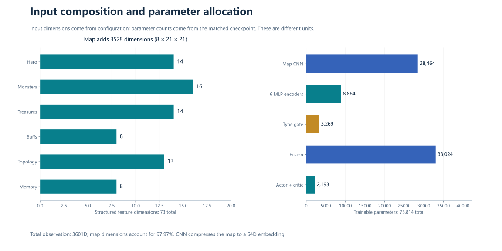
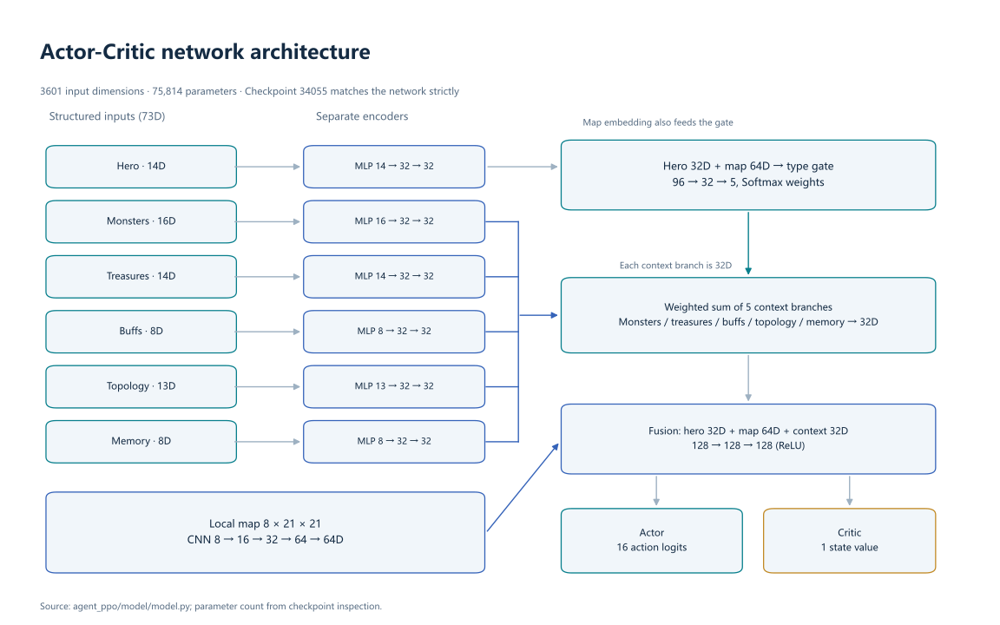
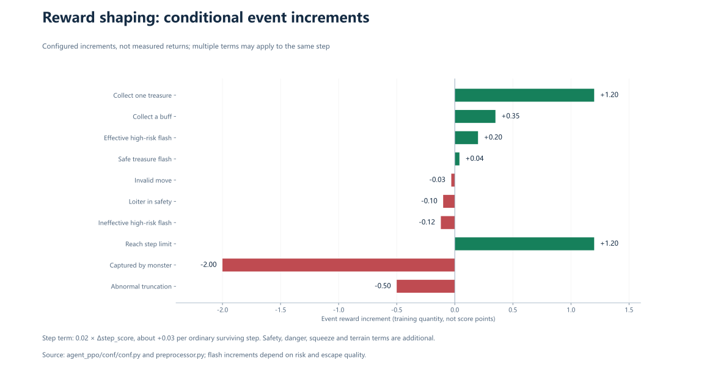

# Method and implementation

[中文](method.zh-CN.md) · [README](../README.en.md)

This document follows the archived code. The report provides context; implementation details below resolve differences between its narrative and the actual fields.

## 1. Observation and memory

`Preprocessor.feature_process(env_obs, last_action)` reads `observation.frame_state`, `env_info`, `map_info` and `legal_act`. It returns six structured branches, the map tensor, action mask, shaped reward and diagnostics. Each call advances internal timers and updates visit heat and caches; preprocessing is stateful.



Flattening offsets are also available in [feature_schema.json](../data/metadata/feature_schema.json).

| Branch | Python slice | Contents |
|---|---|---|
| Hero | `[0:14]` | x/z, progress/remaining fraction, three scores, treasure count, flash availability/cooldown, speed, second-monster flag, fast-monster flag, reference speedup progress |
| Monsters | `[14:30]` | Two eight-field slots: presence, visibility, dx/dz, Euclidean distance, speed, direction enum and distance bucket |
| Treasures | `[30:44]` | Visible/cached proportions; five fields for each target type; nearest visible BFS distance and nearest unknown-cell distance |
| Buffs | `[44:52]` | Active/timer, target presence, dx/dz, Euclidean distance, previous flash flag and flash count |
| Topology | `[52:65]` | Openness, obstacle density, branches, dead-end risk, wall proximity, eight reachable-area ratios |
| Memory | `[65:73]` | Revisit ratio, position diversity, stuck flag, displacement, target dx/dz, unexplored fraction and no-progress flag |
| Map | `[73:3601]` | C×H×W=`8×21×21`, flattened in NumPy order |

The map channels are traversability, obstacles, centered hero, monsters, visible treasures, visible buffs, visit heat and danger. Danger is filled within a 7×7 neighborhood of each monster as `exp(-0.8 × distance)`; overlaps use the maximum.

The 128×128 memory arrays contain information accumulated from observations, not access to the full map.

| Memory | Update |
|---|---|
| Treasure cache | Multiply by 0.995 each call; visible locations become 1; targets require value >0.35; collecting a treasure clears a 3×3 neighborhood around the hero |
| Buff cache | Seen locations remain for the episode; a remembered location does not imply the buff is currently available |
| Visit heat | Multiply by 0.97; add 0.35 at the current position, capped at 1 |
| History queues | 20 positions, 12 actions and 6 displacements |
| Exploration target | Nearest remembered treasure → remembered buff → unknown cell; a feature, not a direct action planner |

Visible treasures are ordered by BFS distance and candidate value; cached treasures use Euclidean distance. Buff targets prefer visible locations, then the nearest remembered point. Monster BFS distances feed diagnostics and flash rewards, rather than the 16D monster input. Buff BFS is also auxiliary. `loiter_flag` is used in reward/diagnostics, not as a separate field of the 8D memory branch.

## 2. BFS and topology

The preprocessor runs equal-cost eight-neighbor BFS from the local-map center. Out-of-view or unreachable targets return the reference distance 20, so these cases share a fallback with targets about 20 steps away. Search does not predict monsters or separately model buff movement and flash.

Directional quality is the reachable cell count from a neighboring first step divided by all traversable cells in the local map. Search can return through the center; directions in the same connected component can therefore have identical values. This is a local connectivity feature, not full escape-route planning.

Openness is the traversable fraction. Branch count is the traversable fraction of eight neighboring cells. Dead-end risk is `1-min(free_neighbor_count/4,1)`, and wall proximity uses the obstacle fraction in the center 3×3. Diagonal BFS checks the destination cell without enforcing the simulator's adjacent-edge constraint, so distances are approximate features.

## 3. Network



Each structured branch has two `Linear → ReLU` layers and a 32D output. The map uses 3×3 padded convolutions:

```text
(8,21,21) → Conv(16) → Conv(32) → MaxPool(2)
           → Conv(64) → AdaptiveAvgPool(1,1) → Linear(64) → ReLU
```

The gate takes hero 32D and map 64D, applies `96→32→5`, then Softmax. Its weights combine the monster, treasure, buff, topology and memory embeddings into a 32D context. Hero, map and context concatenate into 128D; `128→128→128` fusion produces 16 action logits and one state value. No per-state gate activations were retained, so the archive cannot establish which branch dominated a particular situation.

| Module | Parameters |
|---|---:|
| Six MLP encoders | 8,864 |
| Map CNN and projection | 28,464 |
| Type gate | 3,269 |
| Fusion | 33,024 |
| Actor / critic | 2,064 / 129 |
| Total | **75,814** |

The checkpoint holds 44 float32 tensors. See [checkpoint_inspection.json](../data/metadata/checkpoint_inspection.json) for shapes and hashes.

## 4. PPO and samples

Training samples legal actions; evaluation selects the maximum-probability action. Actions 0–7 move east, northeast, north, northwest, west, southwest, south and southeast; 8–15 flash in the same directions. The platform mask mainly indicates skill availability; a legal movement can still hit a wall.

Fixed-size trajectory fields are `obs(3601), legal_action(16), act(1), reward(1), reward_sum(1), done(1), value(1), next_value(1), advantage(1), prob(16)`: 3640 scalar fields. Actions are integer-valued; most other fields are float32. `prob` preserves the full behavior-policy distribution.

GAE is computed backward:

$$\delta_t=r_t+\gamma V(s_{t+1})(1-d_t)-V(s_t),\qquad A_t=\delta_t+\gamma\lambda(1-d_t)A_{t+1}.$$

The value target is `reward_sum = A + V`. The last `next_value` is zero; the workflow treats capture and every truncation as done.

$$L_{policy}=-\mathbb{E}[\min(\rho_t A_t,\operatorname{clip}(\rho_t,0.8,1.2)A_t)],\quad \rho_t=\frac{\pi_{new}(a_t|s_t)}{\pi_{old}(a_t|s_t)},$$

$$L=0.5L_{value}+L_{policy}-0.005H(\pi).$$

`L_value` itself includes `0.5 × max(MSE, clipped_MSE)`. Each 512-sample learner batch is shuffled across four epochs with mini-batches of 256. Advantages are normalized over the full batch. Adam uses lr=3e-4, betas=(0.9,0.999), eps=1e-8; gradient-norm clipping is 0.5. See [configuration.json](../data/metadata/configuration.json).

## 5. Reward shaping



Let `p=1.3` when completed steps ≥500 or danger >0.55, otherwise 1; `q=max(danger,0.25)`. Here `clip(x)` bounds x to [-1,1]. The 500-step threshold comes from a feature reference constant, not the environment's 300-step speedup configuration.

| Term | Increment / condition |
|---|---|
| Step gain | `0.02 × max(Δstep_score,0)`, about +0.03 per ordinary surviving step |
| Treasure gain | `1.2 × max(Δtreasure_score,0)/100` |
| Collect buff | +0.35 |
| Safety distance | `0.10 × clip(Δnearest_monster_Euclidean_distance/4) × p` |
| Danger | `0.12 × (previous_danger-current_danger) × p` |
| Squeeze | `0.08 × (previous_squeeze-current_squeeze) × p` |
| Dead end | `-0.05 × risk × q` |
| Wall proximity | `-0.02 × near_wall × q` |
| Openness | `0.03 × max(openness-0.35,0) × q` |
| Approach treasure | `0.015 × clip((previous_distance-current_distance)/3)`; danger <0.35, no treasure gain |
| Approach buff | `0.012 × clip((previous_distance-current_distance)/3)`; no active buff or current resource gain, danger <0.55, buff distance ≤18, treasure distance >4 |
| Invalid move | Previous action exists but displacement <0.1: -0.03 |
| Safe loitering | Danger <0.35, no treasure/buff gain, position-window distance <5: -0.10 |
| Capture / completion / abnormal truncation | -2.0 / +1.2 / -0.5 |

Danger is `clip(exp(-d1/4)+0.4×exp(-d2/5)+0.2×max(monster_speed-1),0,1.5)`; the second-monster term applies only when both are present. Squeeze is `1-min(1,(d1+d2)/40)`.

Flash tiers are checked in high-risk, medium-risk, then low-risk order:

| Risk before flash | Effective-escape condition | Satisfied / otherwise |
|---|---|---|
| High: danger ≥0.55 or nearest monster ≤6 | Euclidean gain ≥0.55×range, or danger drop ≥0.25, or BFS gain ≥0.60×range | +0.20 / -0.12 |
| Medium: danger ≥0.30 or nearest monster ≤10 | Euclidean gain ≥0.35×range, or danger drop ≥0.08, or BFS gain ≥0.40×range; additionally openness gain ≥0.05 | +0.08 / -0.04 |
| Low | Treasure gain and current danger <0.35 | +0.04 / -0.05 |

Reference range is 10 for cardinal flash and 8 diagonally. “Effective” describes a reward condition, not a measured success rate. Several terms can add at one step; event values in the figure are not complete step rewards.

## 6. Monitoring semantics

Episode metrics are reported approximately every 60 seconds; validation averages once per round; optimizer diagnostics approximately every 60 seconds. Fields are documented in [metrics.csv](../data/metadata/metrics.csv).

- `train_reward` sums shaped episode rewards; `train_total_score` is environment score.
- Optimizer `cum_reward` is actually the batch mean of step rewards, despite its name.
- `entropy_loss` reports positive entropy; the total objective subtracts the entropy term.
- `grad_clip_norm` is the pre-clipping norm returned by the clipping function.
- `approx_kl` averages sampled-action log-probability differences; it can be negative and is not exact full-distribution KL.
- `val_*` exists only when validation runs; no historical values were retained.

## 7. Implementation boundaries

Lightweight validation calls `observation_process` initially and after each step, then calls `exploit(env_obs)`, which processes the same frame again. Because preprocessing is stateful, this repeats cache, timer and history updates. Official platform evaluation uses a separate workflow; no lightweight-validation values were retained.

The environment speeds up monsters at step 300, while the hero-stage feature and reward-pressure reference use 500. `LOITER_WINDOW=10` compares `[-1]` and `[-10]`, spanning nine position changes under one call per frame; 10 is the position-window length. BFS diagonal adjacency differs from the simulator's edge constraint, and directional search can return through the center. These describe code semantics without assigning a performance gain.

See [results](results.en.md) for historical evidence.
