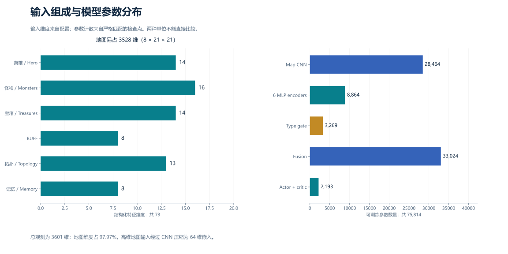
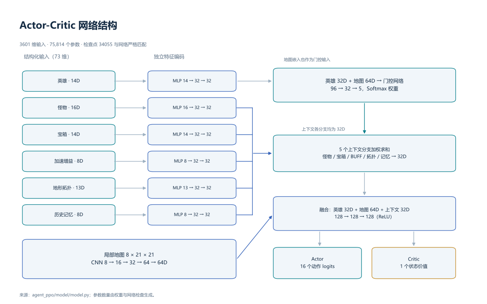
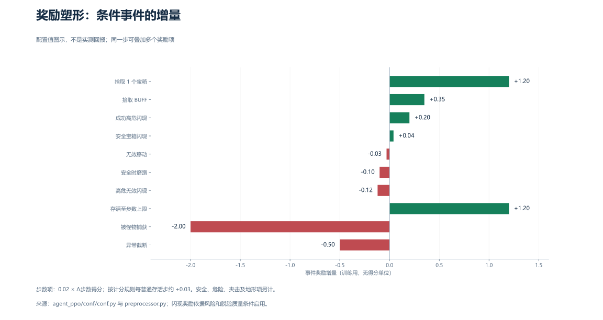

# 方法与实现

[English](method.en.md) · [返回 README](../README.md)

本文以归档代码为准。报告中的设计说明用于背景解释；当描述与实际字段不同，下面给出代码的具体行为。

## 1. 观测与记忆

`Preprocessor.feature_process(env_obs, last_action)` 读取 `observation.frame_state`、`env_info`、`map_info` 和 `legal_act`，返回 6 类结构化特征、地图张量、动作掩码、训练奖励及诊断信息。每次调用都会推进内部计时、更新访问热度与缓存；它不是无状态的数据转换。



展平顺序与偏移见 [feature_schema.json](../data/metadata/feature_schema.json)：

| 分支 | Python 切片 | 组成 |
|---|---|---|
| 英雄 | `[0:14]` | x/z、进度/剩余比例、总分/步数分/宝箱分、宝箱数、闪现可用性/冷却、速度、双怪标志、高速怪物标志、加速阶段参考进度 |
| 怪物 | `[14:30]` | 两个槽位，每槽：存在、在视野内、dx/dz、欧氏距离、速度、方向枚举、距离桶 |
| 宝箱 | `[30:44]` | 可见/缓存比例；可见目标 5 维；缓存目标 5 维；最近可见 BFS 距离、最近未知区距离 |
| BUFF | `[44:52]` | 当前效果标志/剩余比例、目标存在、dx/dz、欧氏距离、上一动作闪现标志、闪现次数 |
| 拓扑 | `[52:65]` | 开阔度、障碍密度、分支数、死胡同、贴墙、8 个方向可达区域比例 |
| 记忆 | `[65:73]` | 重访比例、位置多样性、无位移、位移、探索目标 dx/dz、局部未知比例、无进展 |
| 地图 | `[73:3601]` | C×H×W=`8×21×21`，按 NumPy 展平顺序保存 |

8 个地图通道依次为通路、障碍、中心英雄、怪物、可见宝箱、可见 BUFF、访问热度、怪物危险度。危险通道在怪物附近 7×7 区域内按 `exp(-0.8 × 距离)` 填充；多怪物重叠时取最大值。

全局记忆是 128×128 数组，不等于获得完整地图：探索掩码只标记已经观察的区域，目标缓存只记录曾看到的点位。

| 记忆项 | 更新方式 |
|---|---|
| 宝箱缓存 | 每调用衰减 `×0.995`；可见目标记为 1；阈值 `>0.35`；获得宝箱后清除英雄附近 3×3 缓存 |
| BUFF 缓存 | 可见点记为 1，在当前对局内保留位置；位置存在不代表资源此刻可拾取 |
| 访问热度 | 每调用 `×0.97`；当前位置 `+0.35`，上限 1 |
| 历史队列 | 最近 20 个位置、12 个动作、6 次位移 |
| 探索目标 | 最近缓存宝箱 → 最近缓存 BUFF → 最近未知栅格；只作为特征，不直接生成动作 |

可见宝箱按 BFS 距离、候选价值排序；缓存宝箱按欧氏距离选择。BUFF 分支优先使用可见目标，否则选最近缓存点。怪物 BFS 距离用于诊断和闪现奖励，不直接占据 16 维怪物分支；BUFF BFS 同样用于辅助诊断。`loiter_flag` 在奖励和诊断中使用，并非 8 维记忆分支中的独立字段。

## 2. BFS 与拓扑

从局部地图中心执行等代价的 8 邻域 BFS。超出视野或不可达目标使用参考距离 20；这会把“不可达”和“约 20 步远”映射到同一回退值。搜索不预测怪物运动，也不为 BUFF 或闪现单独建模。

方向质量为：从某方向第一格出发的可达格数 / 当前局部图所有通路格数。搜索可以返回中心，所以多个方向处于同一连通分量时可能得到相同质量；这不是完整逃生路径规划。

拓扑摘要中的开阔度是通路占比，分支数是中心 8 邻格通路比例，死胡同风险为 `1 - min(通路邻格数/4, 1)`，贴墙程度由中心 3×3 的障碍比例得到。对角搜索只检查目标格，不检查环境移动规则中的相邻边约束；局部路径距离是近似特征。

## 3. 网络



6 个结构化分支分别经过两层 `Linear → ReLU`，每分支输出 32 维。地图卷积使用 3×3、padding=1：

```text
(8,21,21) → Conv(16) → Conv(32) → MaxPool(2)
           → Conv(64) → AdaptiveAvgPool(1,1) → Linear(64) → ReLU
```

门控输入为英雄 32 维与地图 64 维，经过 `96→32→5` 得到 Softmax 权重。怪物、宝箱、BUFF、拓扑和记忆五个分支按权重求和为 32 维上下文。英雄、地图、上下文拼接为 128 维，经 `128→128→128` 融合后输出 16 个动作 logits 与 1 个价值估计。门控权重是可学习变量；当前材料没有保存逐状态权重，无法据此断言模型在具体危险状态中关注了哪个分支。

| 模块 | 参数数 |
|---|---:|
| 6 个 MLP 编码器 | 8,864 |
| 地图 CNN 与投影 | 28,464 |
| 门控网络 | 3,269 |
| 融合网络 | 33,024 |
| Actor / Critic | 2,064 / 129 |
| 总计 | **75,814** |

权重共 44 个 float32 张量。完整形状与校验值见 [checkpoint_inspection.json](../data/metadata/checkpoint_inspection.json)。

## 4. PPO 与样本

训练随机采样合法动作；评估选最大概率动作。0–7 为东、东北、北、西北、西、西南、南、东南移动；8–15 为相同方向的闪现。平台掩码主要反映技能可用性；普通移动合法不意味着前方没有墙。

轨迹字段固定长度：`obs(3601), legal_action(16), act(1), reward(1), reward_sum(1), done(1), value(1), next_value(1), advantage(1), prob(16)`，共 3640 个标量字段。动作字段为整数；其余主要为 float32。`prob` 保存采样时完整旧策略分布。

GAE 从轨迹末端向前递推：

$$\delta_t=r_t+\gamma V(s_{t+1})(1-d_t)-V(s_t),\qquad A_t=\delta_t+\gamma\lambda(1-d_t)A_{t+1}.$$

`reward_sum = A + V` 是价值回归目标。最后一步的 `next_value` 固定为 0；当前 workflow 将捕获和所有截断都视为 done。

策略损失与总损失为：

$$L_{policy}=-\mathbb{E}[\min(\rho_t A_t,\operatorname{clip}(\rho_t,0.8,1.2)A_t)],\quad \rho_t=\frac{\pi_{new}(a_t|s_t)}{\pi_{old}(a_t|s_t)},$$

$$L=0.5L_{value}+L_{policy}-0.005H(\pi).$$

代码的 `L_value` 自身包含 `0.5 × max(MSE, clipped_MSE)`。每 Learner 批次 512 个样本，随机打乱并运行 4 轮，mini-batch=256。优势按整个批次标准化；Adam 学习率 3e-4、betas=(0.9,0.999)、eps=1e-8；梯度范数阈值 0.5。完整参数快照见 [configuration.json](../data/metadata/configuration.json)。

## 5. 奖励塑形



令 `p=1.3`（已完成步数 ≥500 或危险度 >0.55），否则 `p=1`；`q=max(危险度,0.25)`；`clip(x)` 表示截断到 [-1,1]。该处 500 来自特征参考常量，不是环境的 300 步怪物加速配置。

| 项 | 代码中的增量 / 条件 |
|---|---|
| 步数收益 | `0.02 × max(Δstep_score,0)`；正常每步约 +0.03 |
| 宝箱收益 | `1.2 × max(Δtreasure_score,0)/100` |
| 拾取 BUFF | +0.35 |
| 安全距离 | `0.10 × clip(Δ最近怪物欧氏距离/4) × p` |
| 危险度 | `0.12 × (前危险度-当前危险度) × p` |
| 夹击 | `0.08 × (前夹击值-当前夹击值) × p` |
| 死胡同 | `-0.05 × 风险 × q` |
| 贴墙 | `-0.02 × 贴墙程度 × q` |
| 开阔地 | `0.03 × max(开阔度-0.35,0) × q` |
| 宝箱接近 | `0.015 × clip((前距离-当前距离)/3)`，危险度 <0.35 且未获得宝箱 |
| BUFF 接近 | `0.012 × clip((前距离-当前距离)/3)`；无 BUFF、无本步资源收益、危险度 <0.55、距离 ≤18、宝箱距离 >4 |
| 无效移动 | 上一动作存在但本次位移 <0.1：-0.03 |
| 安全时磨蹭 | 危险度 <0.35、无宝箱/BUFF 收益、位置窗口距离 <5：-0.10 |
| 捕获 / 完成 / 异常截断 | -2.0 / +1.2 / -0.5 |

危险度为 `clip(exp(-d1/4) + 0.4×exp(-d2/5) + 0.2×max(怪物速度-1), 0, 1.5)`；第二怪物项仅在两只怪物存在时计入。夹击值为 `1-min(1,(d1+d2)/40)`。

闪现按施放前风险分级，条件顺序优先高危、中危、低危：

| 风险 | 成功条件 | 成功 / 不满足条件 |
|---|---|---|
| 高危：危险度 ≥0.55 或最近怪物 ≤6 | 欧氏距离增加 ≥0.55×闪现距离，或危险度下降 ≥0.25，或 BFS 距离增加 ≥0.60×闪现距离 | +0.20 / -0.12 |
| 中危：危险度 ≥0.30 或最近怪物 ≤10 | 欧氏距离增加 ≥0.35×闪现距离，或危险度下降 ≥0.08，或 BFS 距离增加 ≥0.40×闪现距离；并要求开阔度增加 ≥0.05 | +0.08 / -0.04 |
| 低危 | 获得宝箱且当前危险度 <0.35 | +0.04 / -0.05 |

直向闪现参考距离 10，斜向 8。上述“成功”是奖励条件，不是实测的闪现成功率。多个奖励项可以同一步相加，图中事件值不表示完整一步回报。

## 6. 监控与解释

训练工作流约每 60 秒上报一次完成局指标，验证每轮上报一次均值。优化器约每 60 秒上报数值诊断。完整字段见 [metrics.csv](../data/metadata/metrics.csv)。

- `train_reward` 是整局塑形奖励之和；`train_total_score` 是环境分数。
- 算法层 `cum_reward` 实际计算批次中单步奖励均值，命名不表示累计回报。
- `entropy_loss` 记录正的策略熵；总损失中熵项前带负号。
- `grad_clip_norm` 是裁剪函数返回的裁剪前梯度范数。
- `approx_kl` 是实际采样动作的对数概率差均值，可为负，不等同于全分布精确 KL。
- `val_*` 只有 workflow 执行验证时才产生；它们的历史数值不在归档内。

## 7. 实现边界

原始轻量验证在循环外及 step 后调用 `observation_process`，随后 `exploit(env_obs)` 再处理同一帧。因为预处理器带状态，这会重复更新缓存、计时与历史队列。正式平台评测使用另一个工作流；现有材料没有保存轻量验证数值。

环境配置在第 300 步加速怪物，英雄阶段特征与奖励压力使用的参考常量为 500。`LOITER_WINDOW=10` 比较 `[-1]` 和 `[-10]`，每帧一次调用时跨 9 次位置变化；“10”是位置窗口长度。BFS 对角邻接与环境边格约束不同，方向搜索可以返回中心。以上是代码的具体语义，不据此宣称额外性能提升。

历史比赛结果与证据见[结果说明](results.zh-CN.md)。
