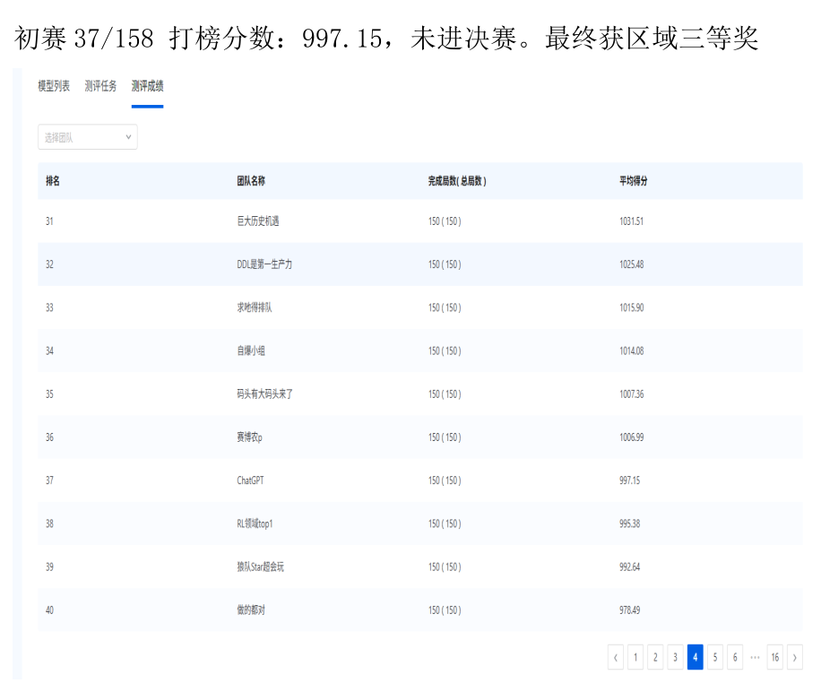
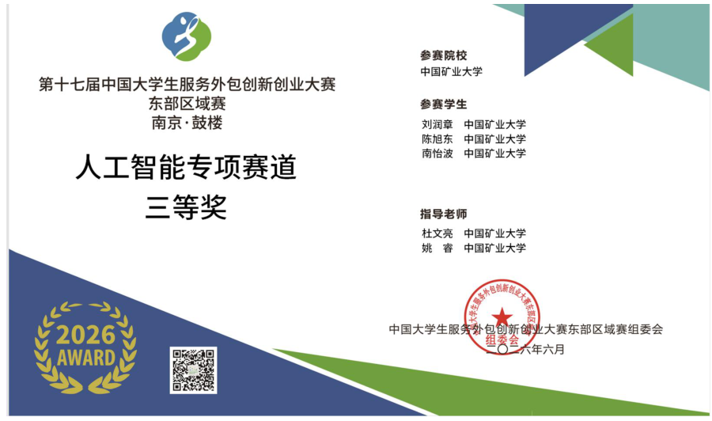

# Historical results, evidence and interpretation

[中文](results.zh-CN.md) · [README](../README.en.md)

## Recorded evidence

| Record | Value | Location | Interpretation |
|---|---|---|---|
| Preliminary rank | 37 | Course report, physical p. 3, screenshot | Row for team `ChatGPT` |
| Total teams | 158 | Text on the same page | Screenshot is partial; no independent full leaderboard retained |
| Leaderboard average score | 997.15 | “Average score” column | Historical platform aggregate, not a new evaluation |
| Completed episodes | 150 of 150 | Same row | Evaluation completion count, not win rate, survival rate or training episodes |
| Final status | Did not advance | Report text | Historical stage outcome |
| Regional award | Artificial Intelligence Track, Third Prize | Certificate on physical p. 4 | 17th competition, Eastern Region, Nanjing/Gulou; June 2026 |
| Report date | 2026-08-28 | pp. 1–2 | Report completion, not model training date |

The images show the relevant PDF regions; full context is in the [original course report](reports/course-report.pdf). Scores and ranks are not recalculated from neighboring teams. Structured records are in [competition.json](../data/results/competition.json) and [competition.csv](../data/results/competition.csv).

## Checkpoint record

| Item | Value / meaning |
|---|---|
| File | `ckpt/model.ckpt-34055.pkl` |
| Size | 316,415 bytes |
| Export timestamp | `2026-04-27T09:07:26.012696+08:00`, from `kaiwu.json` |
| Platform `train_step` | 34055; not a known count of environment transitions or episodes |
| Platform `train_time` | Raw value 27070; source does not specify units, so no hour conversion is made |
| Project / algorithm / version | `gorge_chase` / `ppo` / `15.0.1` |
| Weight verification | 44 tensors, 75,814 parameters, strict load and finite values |
| Optimizer state | Not saved |
| SHA-256 | `4be175c78cdf1c350678070b9fb501556a636fa9c36289dda08c366d4040f030` |

`kaiwu.json.model_file_hash` refers to its named exported ZIP, not the `.pkl` hash above. The ZIP is absent, so these hashes are not compared. The previous configuration references checkpoint 54627, whose weights were not supplied.

The report calls `gorge_chase-ppo-34055-2026_04_27_09_07_26-15.0.1` the final package. The leaderboard screenshot does not expose a submitted model ID.

## Unavailable measurements

Per-episode scores, average treasures, average survival steps, capture rate, hidden-map breakdowns, validation curves, training losses, hardware/time configuration and ablation results were not retained. Report p. 15 proposes ablation experiments without completed numeric results. Monitoring screenshots in the task guide illustrate the platform UI, not this project's training history.

997.15 alone cannot be decomposed into survival and treasure scores. Completion of 150 evaluations does not imply survival to the 1000-step limit. Without episode data, no standard deviation, confidence interval or relative training improvement is calculated.

## Figure provenance

| Figure | Source | Type |
|---|---|---|
| Results | Report text, leaderboard screenshot, certificate | Historical result visualization |
| Network | `agent_ppo/model/model.py` | Implementation diagram |
| Training/validation | Workflow, TOML and constants | Configuration flow |
| Features/parameters | Feature dimensions and inspected weights | Static structural counts |
| Reward events | `conf.py` and reward conditions | Configured increments, not measured returns |

No synthetic training curve, inferred ablation score or unobserved leaderboard result is used. `data/metadata/offline_smoke_check.json` records new software verification; its synthetic-fixture action is not a competition metric.
